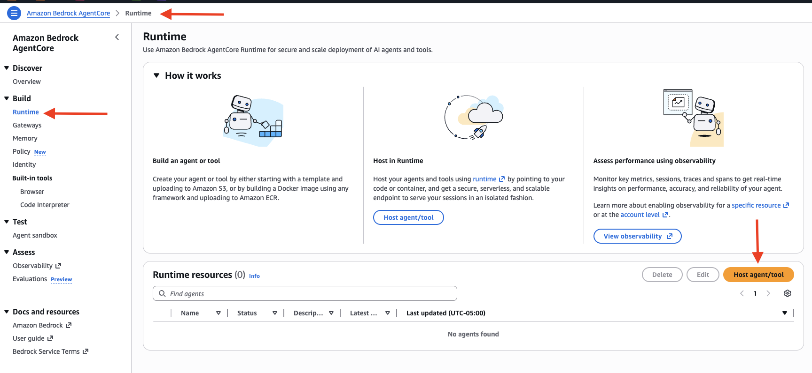
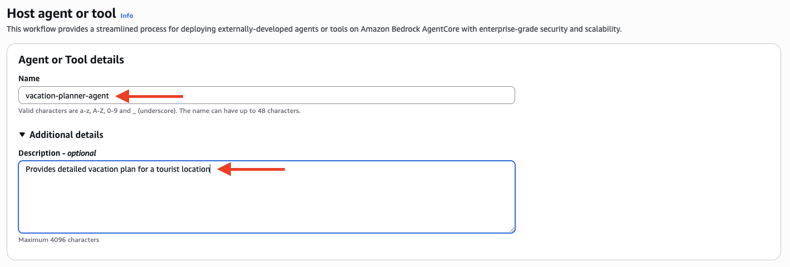

# AgentCore Installation and Run Guide

---

## Pre-Requisites

Before getting started, ensure the following are installed and configured:

- **Docker Desktop** – [Download here](https://www.docker.com/get-started/)
- **AWS Account** – An active AWS account is required
- **AWS CLI** – [Installation guide](https://docs.aws.amazon.com/cli/latest/userguide/getting-started-install.html)
- **IAM Role (AdminRole) for AWS CLI** – Configure via:
  ```bash
  aws configure
  ```
- **Bedrock Model Access** – Enable **NovaPro** in the `us-west-2` region

---

## Steps to Deploy an Agentic App on Bedrock AgentCore Runtime

### Step 1 – AgentCore Import

Import the AgentCore SDK into your project.

> 📄 Reference: [Using Any Agent Framework](https://docs.aws.amazon.com/bedrock-agentcore/latest/devguide/using-any-agent-framework.html)

---

### Step 2 – Add AgentCore Runtime Decorator

Add the AgentCore Runtime Python decorator from the Bedrock AgentCore SDK to your code.

This decorator:
- Defines the function to be executed by the runtime on an incoming event (prompt)
- Creates the following WebServer endpoints:
  - `POST /invocations`
  - `GET /ping`

---

### Step 3 – Create `requirements.txt` and Install Dependencies

Create a `requirements.txt` file in the root folder, then run:

```bash
pip install -r requirements.txt
```

---

### Step 4 – Test Locally

Run the application locally and verify the server is up:

```bash
# Start the application
python src/vacation_planner/crew.py

# Test the ping endpoint
curl http://localhost:8080/ping
```

---

### Step 5 – Docker Build & Deploy

#### Create a Dockerfile

Add a `Dockerfile` to the root of your project.

#### Set Up Docker Buildx

```bash
docker buildx create --use
```

#### Create an ECR Repository

```bash
aws ecr create-repository --repository-name vacation-planner01 --region us-west-2
```

> Replace `vacation-planner01` with your desired repository name.

#### Log In to ECR

```bash
aws ecr get-login-password --region us-west-2 | docker login \
  --username AWS \
  --password-stdin 123456789012.dkr.ecr.us-west-2.amazonaws.com
```

> Replace `123456789012` with your AWS account number and update the region if needed.

#### Build and Push the Image

```bash
docker buildx build --platform linux/arm64 \
  -t 123456789012.dkr.ecr.us-west-2.amazonaws.com/vacation-planner01:latest \
  --push .
```

> Replace the AWS account number and image name (`vacation-planner01`) as appropriate.

> ⚠️ **Note:** The first build may take **up to 30 minutes** due to the ARM64 architecture.

---

### Step 6 – Deploy via AgentCore Service

From the AgentCore Service console, deploy your Agentic AI application using the Docker image pushed to ECR. For it, follow the next steps:

1. Inside the AWS Console, open de Bedrock AgentCore service and click on the `Runtime` option. Then click on the `Host agent/tool` button.



2. Place the next values in the `Agent or Tool details`:
- **Name:** vacation-planner-agent
- **Description - optional:** Provides detailed vacation plan for a tourist location.



---

### Step 7 – Test the Endpoint

Send a test request to your deployed endpoint:

```json
{
  "topic": "Plan a vacation to Bali, Indonesia"
}
```

---

### Step 8 – Create AWS Lambda Function and API Gateway

Set up an AWS Lambda function and connect it to an API Gateway to expose your agent as an API.

---

### Step 9 – Test with Postman

Use Postman to validate the API Gateway endpoint:

1. **Set Method:** `POST`
2. **Enter URL:** Paste your API Gateway URL
3. **Add Header:**
   - Key: `Content-Type`
   - Value: `application/json`
4. **Set Body:** Select `raw` → choose `JSON` from the dropdown → paste your payload

**Sample Payload:**

```json
{
  "prompt": "Plan a 7-day vacation to New York"
}
```

---

### Step 10 – Deploy UI Using Streamlit

1. Add your Streamlit file to the project
2. Replace the placeholder with your actual API Gateway endpoint URL
3. Install Streamlit:
   ```bash
   pip install streamlit
   ```
4. Run the Streamlit app:
   ```bash
   streamlit run streamlit_api.py
   ```

> Replace `streamlit_api.py` with your actual Streamlit filename.

---

*End of Guide*